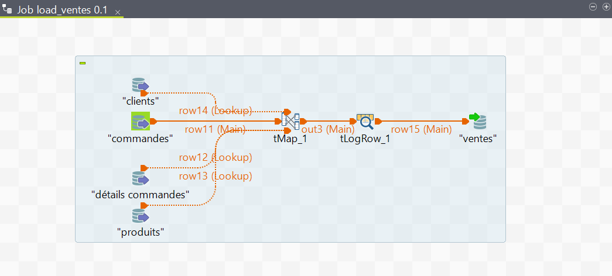

# 📊 Sales BI Data Warehouse & Reporting System

This project implements a complete **Business Intelligence (BI)** solution, starting from a MySQL database and ending with interactive dashboards in Power BI.

---

## 📑 Table of Contents
1. [Project Overview](#-project-overview)  
2. [Tech Stack](#%EF%B8%8F-tech-stack)  
3. [Architecture](#-architecture)  
4. [Key Performance Indicators (KPIs)](#-key-performance-indicators-kpis)  
5. [Project Deliverables](#-project-deliverables)  
6. [Project Previews](#-project-previews)  
   - [Star Schema](#-data-warehouse-design-star-schema)  
   - [ETL Process](#-etl-process-talend-jobs)  
   - [Reporting Dashboards](#-reporting-dashboards-power-bi)  
7. [Authors](#-authors) 

---

## 🚀 Project Overview
The objective of this project was to design and implement a **data warehouse** and a **BI reporting solution** to analyze sales performance.  
The process included:
1. Designing a **star schema** for the data warehouse.
2. Building an **ETL pipeline** with Talend to populate the warehouse.
3. Developing **Power BI dashboards** to visualize KPIs and support decision-making.

---

## 🛠️ Tech Stack
- **Database:** MySQL (Data Warehouse in star schema)  
- **ETL Tool:** Talend Open Studio  
- **Reporting Tool:** Power BI  

---

## 📐 Architecture

The BI system follows a layered architecture:

- **Data Source:** Transactional MySQL database (ComptoirProd)  
- **ETL Layer:** Talend Open Studio for data extraction, transformation, and loading  
- **Data Warehouse:** Star schema (fact + dimension tables) implemented in MySQL  
- **Presentation Layer:** Interactive dashboards in Power BI  

---

## 📊 Key Performance Indicators (KPIs)

The dashboards provide insights on:
- **Total Revenue (Chiffre d’affaires total)**  
- **Total Quantity Sold**  
- **Average Revenue per Sale**  
- **Revenue by Customer**  
- **Revenue by Product**  
- **Product Market Share**  
- **Monthly Sales Trends**  
- **Stock Turnover**  
- **Discounts Applied**  
- **Geographic Analysis (by city, region, country)**  

---

## 📂 Project Deliverables

- **Data Warehouse**
  - [`datawarehouse/sales_datawarehouse.sql`](./datawarehouse/sales_datawarehouse.sql) – MySQL dump of the warehouse schema  

- **ETL**
  - [`etl/sales_etl_pipeline_talend.zip`](./etl/sales_etl_pipeline_talend.zip) – Talend project for ETL  

- **Reporting**
  - [`reporting/sales_reporting_dashboard.pbix`](./reporting/sales_reporting_dashboard.pbix) – Power BI dashboard  
  - [`reporting/reporting-visuals.pdf`](./reporting/reporting-visuals.pdf) – PDF with dashboard screenshots  

- **Documentation**
  - [`docs/project_specifications_bi.pdf`](./docs/project_specifications_bi.pdf) – Original project specification  
  - [`docs/mini-report.pdf`](./docs/mini-report.pdf) – Mini report describing KPIs, schema, and architecture  

---

## 📸 Project Previews

### 🔹 Data Warehouse Design (Star Schema)
  
*Star schema implemented in MySQL Workbench, showing the central fact table (sales) and connected dimension tables (clients, products, time).*

---

### 🔹 ETL Process (Talend Jobs)
Below are the Talend jobs created to load different dimensions and the fact table into the data warehouse:

- **Load Clients**  
    
  *ETL job to extract client data from the source system and load it into the client dimension table.*  

- **Load Products**  
    
  *ETL job to extract and load product information into the product dimension.*  

- **Load Sales**  
    
  *ETL job to populate the sales fact table with transactional data.*  

- **Load Time**  
    
  *ETL job to generate and load time dimension data for temporal analysis.*  

---

### 🔹 Reporting Dashboards (Power BI)
Here are examples of the Power BI dashboards developed for sales analysis:

- **Dashboard Page 1**  
    
  *Overview of sales KPIs including total revenue, total sales, and performance by product.*  

- **Dashboard Page 2**  
    
  *Geographic and client-based analysis showing sales distribution across regions and customer segments.*  

---

## 👨‍💻 Authors
- **Fahd EL ATTAR**  
- **Anouar EL GORCH**  

---
